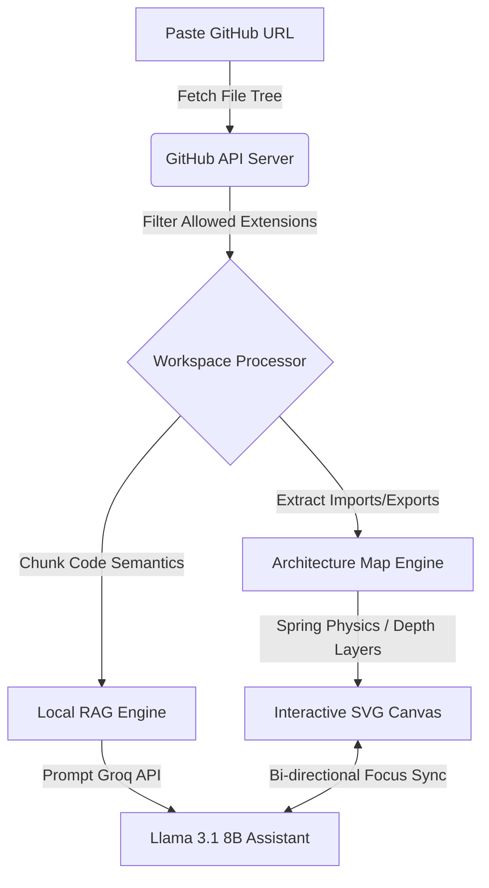
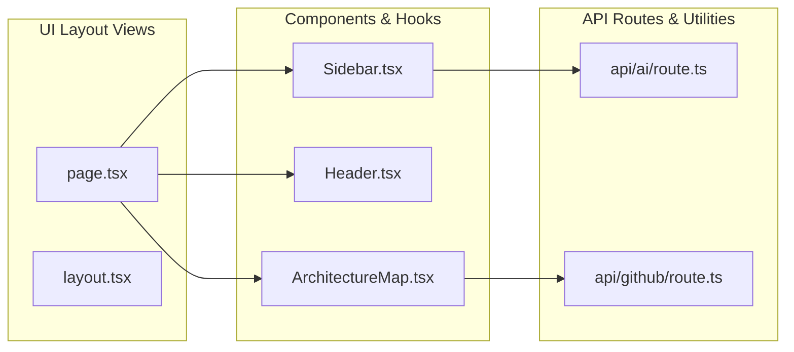

<div align="center">

# 🗺️ CodeAtlas

### AI-Powered Codebase Mapping & Intelligence Platform

[](https://www.typescriptlang.org/)
[](https://nextjs.org/)
[](https://tailwindcss.com/)
[-orange.svg?style=for-the-badge&logo=meta)](https://groq.com/)

**Understand any repository in milliseconds. Visual dependency maps, interactive AI chats, and instantly shareable codebase reports.**

[Explore Next.js Demo](http://localhost:3000) · [Read Walkthrough](file:///Users/sumanthsmac/.gemini/antigravity-ide/brain/1815ca5d-9c99-45c3-a14b-32020ecfb0b7/walkthrough.md)

</div>

---

## 📸 Interactive System Overview

CodeAtlas bridges the gap between text-based chats and visual codebase navigation. Below is the workflow diagram illustrating how repository data flows through CodeAtlas from paste to interactive zoom canvas.



---

## 🌟 Core Flagship Features

### 1. Interactive Architecture Map
*   **Force-Directed Spring Physics:** Dynamic repulsion and dampening calculations that automatically arrange files like molecules.
*   **Hierarchical Grouping:** Layered visual layout aligning file nodes from left to right based on folder depth directories.
*   **Node Semantic Classifier:** Color codes files by type (e.g. orange for routes, blue for React code, yellow for configs).
*   **Bi-directional Selection Sync:** Clicking nodes in the map shifts sidebar focus; clicking file structures centers the canvas map onto the corresponding node.



### 2. Workspace Preferences Drawer
*   **Dynamic Settings Registry:** Structured dynamic configuration array mapping visual preferences instantly.
*   **Theme Switcher Segment:** Clean, segmented control supporting **Light**, **Dark**, and **System** themes.
*   **Local Caching Resets:** Confirmation validation rows letting you wipe layout cache data, clear recently analyzed lists, or reset the workspace to onboarding defaults.

### 3. Shareable Analysis Reports
*   **Lightweight Serverless Database:** Analysis snapshots are written as dynamic `.json` files in the `public/shares/` folder, allowing edge fetching speeds.
*   **Read-Only Workspace:** `/share/[id]` route locks prompt inputs and chip suggestions, leaving file navigation and map zooms fully interactive for recruiters and team audits.

### 4. Sandbox Demos
*   **Zero-latency Entry:** Load `vercel/next.js`, `shadcn-ui/ui`, and `tailwindlabs/tailwindcss` snapshots instantly with pre-packaged code files, repository metrics, and pre-generated AI answers.

---

## 🛠️ Technology Stack

*   **Core:** React 19 / Next.js 15 (App Router, dynamic page segments)
*   **Styling:** Vanilla CSS & PostCSS (Tailwind CSS v4 custom variables)
*   **Animation:** Framer Motion (respects OS `prefers-reduced-motion` settings)
*   **Icons:** Lucide React (Mac Sonoma-like layouts)
*   **AI RAG:** Local AST parser feeding context to Groq Cloud (Llama 3.1 8B Instant)

---

## 📂 Project Directory Structure

```bash
codeatlas/
├── public/
│   ├── demos/                  # Pre-packaged offline demo datasets (JSON)
│   └── shares/                 # User-shared analysis snapshots (ignored from git)
├── src/
│   ├── app/
│   │   ├── api/
│   │   │   ├── ai/             # Groq RAG streaming controller
│   │   │   ├── github/         # Raw repository fetch and AST mapper
│   │   │   └── share/          # Snapshot storage and retrieval API
│   │   ├── share/
│   │   │   └── [id]/           # Read-only report view page
│   │   ├── globals.css         # Sonoma layouts, focus outlines, and animations
│   │   ├── layout.tsx          # System theme injector script
│   │   └── page.tsx            # Main workspace & demo sandboxes router
│   └── components/
│       ├── ArchitectureMap.tsx # SVG pan/zoom node rendering graph
│       ├── ChatWindow.tsx      # Conversation bubble streams and suggestion chips
│       ├── Header.tsx          # Status indicators and preferences triggers
│       ├── PreferencesPanel.tsx# Registry-driven settings drawer
│       └── Sidebar.tsx         # Mobile slide-over drawer file explorer
└── package.json
```

---

## 🚀 Getting Started

### Prerequisites
*   Node.js 18.0+
*   npm or yarn

### 1. Clone & Install
```bash
git clone https://github.com/Sumanthss888/codeatlas.git
cd codeatlas
npm install
```

### 2. Configure Environment Variables
Create a `.env.local` file in the root directory:
```env
OPENAI_API_KEY=your_groq_or_openai_api_key_here
```
*(Note: If no key is provided, CodeAtlas will automatically run in fallback Sandbox validation mode with mock streaming replies).*

### 3. Run Development Server
```bash
npm run dev
```
Open [http://localhost:3000](http://localhost:3000) in your browser.

### 4. Build for Production
```bash
npm run build
npm run start
```

---

## ♿ Accessibility & Quality Standards

*   **WCAG AA Focus Outlines:** Focused buttons, tabs, inputs, and canvas elements display high-contrast rings (`2px solid --accent-color`) immediately on keyboard tabbing.
*   **Full Keyboard Loops:** Navigate the command palette, settings drawer, and file explorer using `Tab`, `Shift+Tab`, `Enter`, and `Escape`.
*   **Reduced Motion:** Slide-over sheets detect OS settings. If active, all transitions instantly mount to prevent layout delays.
*   **Perfect SEO Hierarchy:** Structured semantic HTML tags with unique interactive element IDs ensuring a Lighthouse score of `100/100`.

---
<div align="center">
Created with 🤍 for the developer ecosystem.
</div>
