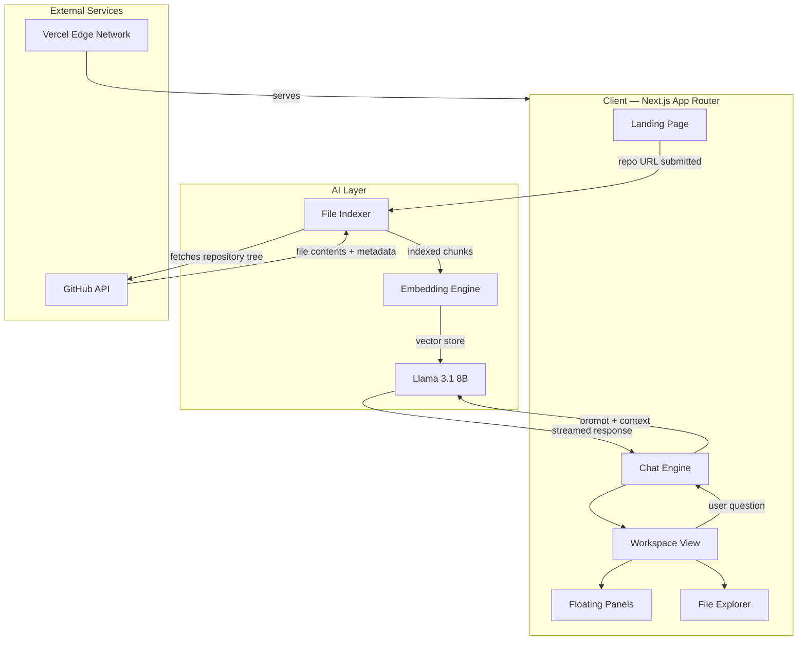
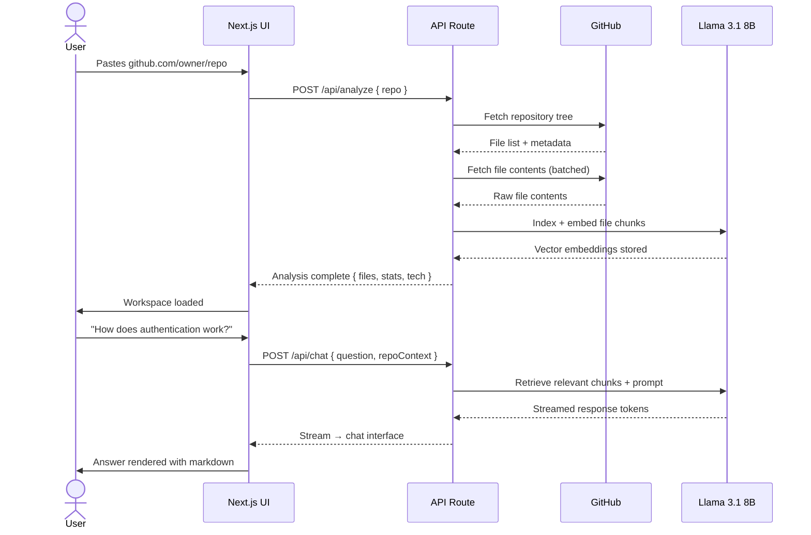
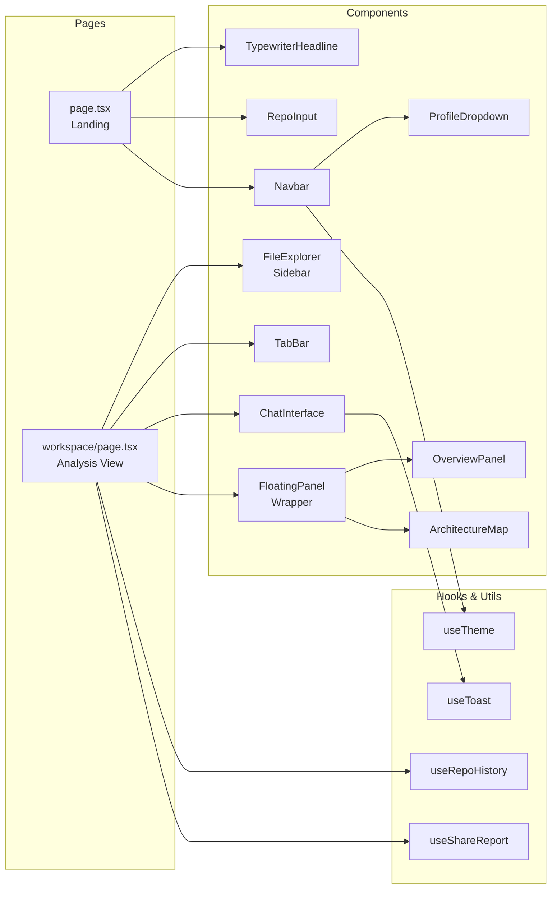

<div align="center">


# CodeAtlas

**AI-powered codebase intelligence for developers.**

Understand any GitHub repository in minutes — trace architecture, explore file structures, and ask questions about any codebase using AI.

<br />

[](https://codeatlas-eight.vercel.app/)
[](https://nextjs.org/)
[](https://www.typescriptlang.org/)
[](https://tailwindcss.com/)
[](LICENSE)

<br />


</div>

---

## Overview

CodeAtlas is a developer tool that transforms any public GitHub repository into an instantly understandable knowledge base. Paste a URL, and the AI indexes every file, maps the codebase architecture, detects the technology stack, and opens a natural language interface to answer questions about the code.

Built as a portfolio-quality project demonstrating full-stack AI integration, advanced UI engineering, and production-grade deployment.

---

## Features

| Feature | Description |
|---|---|
| **Repository Analysis** | Indexes any public GitHub repo — files, folders, languages, size |
| **Architecture Map** | Interactive force-directed and hierarchical graph of file relationships |
| **AI Chat Interface** | Ask anything about the codebase in natural language |
| **Workspace Overview** | Tech stack detection, language distribution, GitHub insights, codebase metrics |
| **File Explorer** | Full repository tree with filter search and file-level navigation |
| **Floating Glass Panels** | Overview and Architecture panels float over the workspace (Apple-style) |
| **Instant Sandbox Demos** | Pre-loaded analysis for Next.js, shadcn/ui, and Tailwind CSS |
| **Repo History** | Recently analyzed repositories saved locally |
| **Share Report** | Shareable permalink with deep-link auto-analysis |
| **Keyboard Shortcuts** | Full keyboard navigation throughout the application |
| **Command Palette** | Global ⌘K command palette for power users |
| **Profile System** | Local username system with persistent avatar |

---

## Architecture

### System Overview



### Data Flow



### Component Architecture



---

## Tech Stack

### Frontend

| Technology | Version | Purpose |
|---|---|---|
| Next.js | 14 | React framework, App Router, API routes |
| TypeScript | 5.0 | Type safety across the entire codebase |
| Tailwind CSS | 3.0 | Utility-first styling |
| React | 18 | UI component library |

### AI & Data

| Technology | Purpose |
|---|---|
| Llama 3.1 8B | Core language model for analysis and Q&A |
| Vector Embeddings | Semantic search over repository files |
| GitHub REST API | Repository tree and file content fetching |

### Infrastructure

| Service | Purpose |
|---|---|
| Vercel | Production deployment, Edge Network |
| GitHub | Source control, CI/CD trigger |

---

## Project Structure

```
codeatlas/
├── app/
│   ├── page.tsx                  # Landing page
│   ├── layout.tsx                # Root layout, font loading
│   ├── globals.css               # Design tokens, animations
│   └── workspace/
│       └── page.tsx              # Analysis workspace
│
├── components/
│   ├── landing/
│   │   ├── TypewriterHeadline.tsx   # Animated cycling headline
│   │   ├── RepoInput.tsx            # Glass pill URL input
│   │   ├── SandboxShowcases.tsx     # Pre-loaded demo repos
│   │   └── HowItWorks.tsx           # 3-step explainer section
│   │
│   ├── workspace/
│   │   ├── FileExplorer.tsx         # Left sidebar file tree
│   │   ├── TabBar.tsx               # Overview / Architecture / Chat tabs
│   │   ├── ChatInterface.tsx        # AI conversation panel
│   │   ├── FloatingPanel.tsx        # Apple-style overlay wrapper
│   │   ├── OverviewPanel.tsx        # Repo stats and insights
│   │   └── ArchitectureMap.tsx      # Force-directed node graph
│   │
│   └── ui/
│       ├── Navbar.tsx               # Global navigation bar
│       ├── ProfileDropdown.tsx      # Local auth system
│       ├── CommandPalette.tsx       # Global ⌘K overlay
│       ├── Toast.tsx                # Notification system
│       └── SearchBar.tsx            # Unified search component
│
├── hooks/
│   ├── useRepoHistory.ts         # localStorage recent repos
│   ├── useShareReport.ts         # Permalink generation
│   └── useTypewriter.ts          # Typewriter animation logic
│
├── lib/
│   ├── github.ts                 # GitHub API client
│   ├── indexer.ts                # File chunking and indexing
│   └── ai.ts                     # LLM prompt construction
│
└── public/
    ├── logo.png
    └── og-image.png
```

---

## Getting Started

### Prerequisites

- Node.js 18+
- npm or yarn
- A GitHub account (for API access)

### Installation

```bash
# Clone the repository
git clone https://github.com/Sumanthss888/codeatlas.git
cd codeatlas

# Install dependencies
npm install

# Set up environment variables
cp .env.example .env.local
```

### Environment Variables

```bash
# .env.local

# GitHub API (optional — increases rate limit from 60 to 5000 req/hr)
GITHUB_TOKEN=your_github_personal_access_token

# AI Provider
AI_API_KEY=your_ai_api_key
AI_MODEL=llama-3.1-8b
```

### Run Locally

```bash
npm run dev
```

Open [http://localhost:3000](http://localhost:3000) in your browser.

### Deploy to Vercel

```bash
npx vercel --prod
```

Or connect your GitHub repository to [Vercel](https://vercel.com) for automatic deployments on every push.

---

## Usage

**1. Analyze any public repository**

Paste a GitHub URL into the input field:
```
https://github.com/vercel/next.js
https://github.com/facebook/react
https://github.com/your-org/your-repo
```

**2. Explore the workspace**

- **Overview** — view tech stack, language distribution, GitHub stats, and codebase metrics
- **Architecture Map** — interactive graph of file relationships, switch between Force Directed and Hierarchical layouts
- **Chat** — ask questions about the codebase in plain English

**3. Keyboard shortcuts**

| Shortcut | Action |
|---|---|
| `⌘ K` | Open command palette |
| `⌘ Enter` | Submit repository for analysis |
| `Escape` | Close any open panel |
| `1` `2` `3` | Switch between tabs |
| `?` | Show all keyboard shortcuts |

---

## Design System

CodeAtlas uses a custom glass morphism design system inspired by Apple, Resend, and Linear.

```
Background:   #0A0A0F  — near-black with blue undertone
Accent:       #4F6EF7  — electric indigo (primary brand color)
Secondary:    #7B5CF0  — violet (gradient pair)
Text:         #F2F2F7  — Apple-style off-white
Muted:        #98989F  — secondary text
Glass:        rgba(255,255,255,0.04) + blur(20px)
```

**Typography**
- Display / Headings — Outfit (300–700)
- Body / UI — Inter (400–500)
- Code / Paths — JetBrains Mono (400–500)

---

## Roadmap

- [ ] Export analysis as PDF or Markdown
- [ ] File click → AI explanation popup
- [ ] Color-coded nodes in Architecture Map by file type
- [ ] Repo comparison mode (side by side)
- [ ] Private repository support via GitHub OAuth
- [ ] Saved analyses with user accounts

---

## Contributing

Contributions are welcome. Please open an issue first to discuss what you would like to change.

```bash
# Fork the repo, then:
git checkout -b feat/your-feature-name
git commit -m "feat: add your feature"
git push origin feat/your-feature-name
# Open a pull request
```

---

## License

MIT — see [LICENSE](LICENSE) for details.

---

<div align="center">

Built by [Sumanth](https://github.com/Sumanthss888)

[Live Demo](https://codeatlas-eight.vercel.app/) · [Report a Bug](https://github.com/Sumanthss888/codeatlas/issues) · [Request a Feature](https://github.com/Sumanthss888/codeatlas/issues)

</div>
